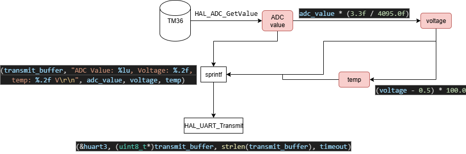

## Prosjektbeskrivelse

Oppgaven går ut på å lese analoge data fra en TMP36 temperatursensor via ADC, konvertere ADC-verdien til spenning og deretter til temperatur i Celsius, og sende disse dataene kontinuerlig over UART til en PC.

- Sensoren er koblet til 3.3V, GND og pin PA3 som analog inngang, og UART brukes på pin PD9 for RX og PD8 for TX for seriell kommunikasjon med PC.
- build flags er oppdatert for å tillate bruk av float i sprintf  build_flags = -IInc -Wall -Wl,-u,_printf_float
- det er lagd en void MX_USART3_UART_Init(void) funksjon som initaliserer usart kommunikasjon, hvor denne ikke var definert eller deklarert per default

  flow

  exsempel output:
  
ADC Value: 967, Voltage: 0.78, temp: 27.93 V
ADC Value: 961, Voltage: 0.77, temp: 27.44 V
ADC Value: 967, Voltage: 0.78, temp: 27.93 V
ADC Value: 965, Voltage: 0.78, temp: 27.77 V
ADC Value: 969, Voltage: 0.78, temp: 28.09 V
ADC Value: 968, Voltage: 0.78, temp: 28.01 V
ADC Value: 964, Voltage: 0.78, temp: 27.68 V
ADC Value: 967, Voltage: 0.78, temp: 27.93 V
ADC Value: 962, Voltage: 0.78, temp: 27.52 V
ADC Value: 965, Voltage: 0.78, temp: 27.77 V
ADC Value: 963, Voltage: 0.78, temp: 27.60 V
ADC Value: 963, Voltage: 0.78, temp: 27.60 V
ADC Value: 964, Voltage: 0.78, temp: 27.68 V
ADC Value: 958, Voltage: 0.77, temp: 27.20 V
ADC Value: 964, Voltage: 0.78, temp: 27.68 V

